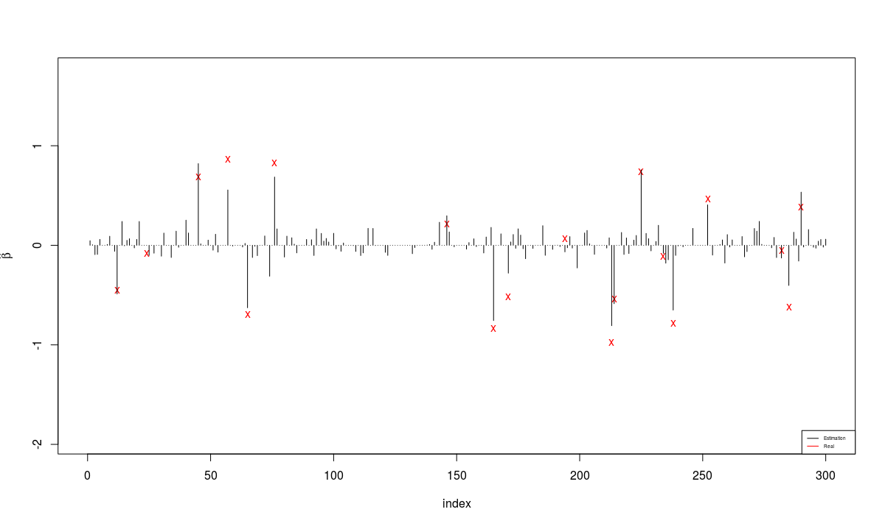

Paftoga
==========

This package will solve AFT model in high-dimensional case. 


emplik3
====
Paftoga may use several functions provided in [emplik](http://cran.r-project.org/web/packages/emplik "emplik"). After proper profiling, at least in one dimensional case of the hypothesis testing program *el.cen.EM*, the computational speed could be promoted dramaticly using C/C++. One doen't need to rewrite it in pure C/C++ code.

- I provide a `cumsumsurv` which could calculate `rev(cumsum(rev(x)))` in C code.    
- A C-code uniroot funtion is provided.
- There are several hidden "double/tripple" loops in original R code. Now it is in C code.


```{r}
devtools::install('emplik3')
set.seed(65535)
x <- rexp(10000)
d <- as.numeric(runif(10000)>=.5)
tic=proc.time()
re3=emplik3::el.cen.EM(x,d,mu=1)
toc=proc.time()


tic1=proc.time()
re=emplik::el.cen.EM(x,d,mu=1)
toc1=proc.time()

cat('R version',sessionInfo()[[1]]$nickname,'. Use OpenBLAS(MINGW64).\n')
cat('New pack Time')
toc-tic
cat('Old pack Time')
toc1-tic1
cat('Check uniqueness rate(tol=1e-14):\t',100*sum(abs(re$prob-re3$prob)<1e-14)/length(re$prob),'%\n')
```


R version Frisbee Sailing . Use OpenBLAS(MINGW64).

New pack Time

| user | system | elapsed |
|:----:|:------:|:-------:|
| 1.96 | 0.00   | 1.95    |

Old pack Time

| user  | system | elapsed |
|-------|--------|---------|
| 16.76 | 0.00   | 16.77  | 
  
  Check uniqueness rate(tol=1e-14):   100 %
  
With only six lines changes in el.cen.EM2, it is has similar behavior.

```{r}
library(survival)
time <- cancer$time
status <- cancer$status-1
###for mean residual time
N=10000
y=rexp(N)
x=rnorm(N)
d=as.numeric(runif(N)>.3)

coeef=lm.wfit(x=cbind(rep(1,N),x), y=y, w=emplik::WKM(x=y, d=d)$jump[rank(y)])$coef

myfun7 <- function(y, xmat) {
  temp1 <- y - ( coeef[1] + coeef[2] * xmat)
  return( cbind( temp1, xmat*temp1) )
}
system.time(emplik::el.cen.EM2(y,d, fun=myfun7, mu=c(0,0),xmat=x))
system.time(emplik3::el.cen.EM2(y,d, fun=myfun7, mu=c(0,0),xmat=x))
```

| Type  | user	| system	| elapsed |
|-------|-------|---------|---------|
| emplik	| 22.61	| 1.65	| 14.66   |
| emplik3	| 6.39	| 1.27	| 2.52    |


#HD-AFT

Developing

```R
set.seed(65535)
p = 800
n = 1000
p.zero= p-ceiling(log(n)^1.5)# 600-32
ST=1;

using.glmnet=T
using.oga=F
using.inteceptstragtegy=F

  X=matrix(rnorm(p*n)/4,ncol=p);
  beta=4*runif(p)-2
  beta=(beta+0.1*sign(beta))
  zero.loc=sample(1:p,p.zero);
  #beta[zero.loc]=runif(p.zero,-.002,.002)
  beta[zero.loc]=0
  sigma=2
  #eps= - sigma*log(rexp(n)) # exp: std Gumbel * sigma
  eps= - sigma*rnorm(n) # exp: std Gumbel * sigma  
  f_Xst <- function(x) t(t(x)-apply(X,2,mean))
  X= f_Xst(X)
  Y= X%*%beta + eps
  cen=rexp(n,rate=1)*2+abs(rt(n=n,df=10))*2
  YC=apply(cbind(cen,Y),1,min)
  delta=as.double( YC == Y);
  delta[1]=1;
  sigma0=1;
  scale=2;
  Y=Y/scale
  YC=YC/scale
  beta0=rep(.2,p);
  beta.real<-beta/scale
```

Simulation result:



